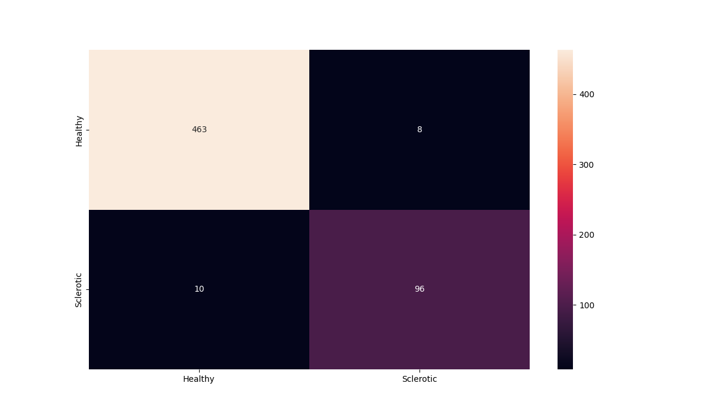

# Globally_Sclerotic_Glomeruli
Deep learning for binary classification of globally sclerotic glomeruli from 

## Overview
This project focuses on the binary classification of PAS stained microscopy images of Kidney Glomerulus using deep learning techniques. Glomerulus images are classified into two categories: Non-Globally Sclerotic (label 0) and Globally Sclerotic (label 1).

## Table of Contents
1. [Setting aside a Test set](#test-set)
2. [Inspection of the data](#inspection)
3. [Preprocessing of the data](#preprocessing)
4. [Padding](#type-of-padding)
5. [Approach and baseline models](#approach)
6. [Implementation](#implementation)
7. [Homemade CNN models 97+% accuracy](#homemade-models)
8. [Large Pretrained Models 99+% accuracy](#large-pretrained-models)
9. [Instructions for Reproducibility](#instructions-for-reproducibility)
10. [Results](#results)

IMPORTANT: Only students who have a faculty sponsor can access HiperGator premium resources. Students who are onlhy taking a course that uses HiperGator would have access to limited HiperGator resources. Since I do not have a facuty sponsor nor are any of my current courses using HiperGator, I do not have access to HiperGator. So, I have used only Google Collab Pro. 

## Separate Test Set

Usually, I would first split the data and set a test set aside before inspecting the data, and until the models were trained.
However, since it was Dr. Paul wrote that a hold out set of in-distribution data has already been created by Dr. Paul and Dr. Naglah, so I split the available data and created a separate test set aside in my notebook code after inspecting the data, but before starting to train the models.

### Train_Val_Test_Split
The entire 100% data was train_val_test split in the ratio of 80:10:10 pseudo-randomly using five different seeds to repeat the experiments five times and emulate Scikit-Learn's 5-Fold Cross Validation. However, only one of the seeds is given in the code.
Since the dataset had more than 5000 samples, cross validation was not necessary since 577 samples in the test set is considered sufficient to test the models performance. Hence, I did not use cross validation and instead tried to emulate it using five random seeds.

## Inspection

Caveat: It is possible that multiple image files in the dataset come from a single whole slide image or from a single patient or subject. This was not mentioned in the instructions nor was it clear from inspecting the dataset. Hence, I treated each image file individually. However, this most probably led to data leakage. If you can let me know how exactly multiple images can be identified to belong to the same subject, then I would need to split the dataset on the subject-level and retrain the models.

### Dataset:

a. I found that the images in the dataset were already cropped as a rectangle to include only the glomerulus, i.e, the region of interest.

b. Images were of different sizes, and all were not square.

c. There were 5758 images in the entire dataset.

d. There was an imbalance of more than 1:4 with regard to the Positive:Negative class in the dataset as shown in the following figure. I would address the imbalance only if required after seeing the performance of the trained models.

## Preprocessing

### Code is in 1_Preprocess_Data folder

I did not intend to train Fully convolutional Neural Networks, and other types of networks expect the input images to be of the same size.
 
Hence, I made the images square using: white-padding or zero-padding.

I resized the resulting images to common sizes such as: 128x128 and 224x224 (for pretrained models) and 512x512.

My code ensures that the glomerulus in the image is centered in both the Zero padding and White Padding variants.

## Type of Padding

I needed to know whether to progress with the resized images containing white-padding or zero-padding.

### Zero Padding:

Advantages:
Preserves the original intensity distribution of the image.
Can be beneficial when the background of the images is not uniform or does not have a consistent color.
Helps in avoiding the introduction of bias towards any specific intensity value in the image.

Disadvantages:
May introduce noise or irrelevant information when padding with zeros if the model is sensitive to the background information.
Could potentially increase computational cost during training and inference due to the larger input size.

### White Padding:

Advantages:
Can help to maintain consistent background across images, which could be beneficial if the background carries irrelevant information for your task.
May lead to better generalization if the background is not informative for the classification task.

Disadvantages:
Risks introducing bias towards white color in the model's learning process, especially if the background of the original images is not white.
May cause loss of original intensity information, which could be important for certain tasks.
In the context of analyzing PAS stained images of kidney glomerulus, the choice between zero padding and white padding should be made based on empirical evaluation and domain knowledge. If the background information in the images is irrelevant or noisy, white padding might be preferred to provide a consistent background for the model to learn from. However, if maintaining the original intensity distribution is crucial for your task, zero padding could be a better choice.

Ultimately, it's recommended to experiment with both padding strategies and evaluate their performance on your specific deep learning task to determine which one works best for your dataset and model architecture.

### Images from the folder 2_WhitePad_OR_ZeroPad

Since I had already built a PyTorch model with the glomerulus images that Sam had kindly given me two weeks back, I trained that same model for 20 epochs each on both the zero-padded and white-padded images, and at dimensions of 128x128 pixels and 224x224 pixels. I have not provided the code of that basic preliminary model, but I may be willing to provide it in a sequel. The following figures show the preliminary results.

#### Zero padding 128x128 pixels

#### White padding 128x128 pixels

#### Zero padding 224x224 pixels

#### White padding 224x224 pixels

Conclusion: Except for the sudden dip in the middle of the last validation curve, I found that the white padding provided more stable training and validation curves. Hence, I decided to continue using only the White-Padded version of pre-processed images.

Since I am using Google Collab Pro, not HiperGator, usable RAM is around 20 GB, and so I decided not to use the 512x512 resized images due to low RAM.

The preliminary results show that 128x128 sized images were providing better results than the 224x224 images. Since I was already getting 97% accuracy with a simple model, I thought there would be no point in using large architectures or pretrained models that prefer 224x224 sized images. However, later I decided to use 224x224 pixel images with the large architectures.

## Approach

### The experiments, code and model summaries for this section is in the notebook in folder 3_Baseline_Models

I made a baseline model using only one neuron with sigmoid activation function, and no hidden layers. This was basically Logistic Regression, and could only model linear relationships in the data. Yet, it got 90% accuracy on the test set.

#### No Hidden Layers (49152 = 128x128x3) Test result: 89.601 loss: 0.244

Subsequently, I used a simplified version of the approach in the following publication.

"Convolutional neural networks for classification of Alzheimer's disease: Overview and reproducible evaluation," Junhao Wen, Elina Thibeau-Sutre, Mauricio Diaz-Melo, Jorge Samper-González, Alexandre Routier, Simona Bottani, Didier Dormont, Stanley Durrleman, Ninon Burgos, Olivier Colliot, Medical Image Analysis, Volume 63, 2020, 101694, ISSN 1361-8415.

Step 1. Repeatedly add a Dense layer until the model overfits.

Step 2. Replace the largest Dense layer with a Convolutional block

Step 3. Go back to step 1 and repeat until there is no further improvement.

Step 4. Add another Convolutional block to make the model learn  more useful features.

Step 5. Go back to step 1 and repeat until there is no further improvement.

#### Other variables

a. I used 50-60 epochs to give the model time to learn and overfit
b. mini batch size of 64
c. Adam optimizer
d. Learning Rate = 0.0001
e. L2 regularization for the kernel

#### One Large Dense Hidden Layer (49152 = 128x128x3) Test result: 92.721 loss: 0.224

#### One Small Dense Hidden Layer (49152 = 128x128x3) Test result: 91.854 loss: 0.213

#### Two Large Dense Hidden Layers (49152 = 128x128x3) Test result: 92.721 loss: 0.166

Since the architecture was not able to learn enough, I added a CNN layer.

#### One CNN Layer and Two Large Dense Hidden Layers (49152 = 128x128x3) Test result: 96.534 loss: 0.102

The model is learning more. So, I added another Dense layer to make it overfit.

#### One CNN Layer and Three Dense Hidden Layers (49152 = 128x128x3) Test result: 96.534 loss: 0.107

I added another Convolutional layer to make the model learn more features.

#### Two CNN Layers (layer 2 has double the filters) and Three Dense Hidden Layers (49152 = 128x128x3) Test result: 96.187 loss: 0.101

#### To smoothen the accuracy curves, I added Batch Normalization. Test result: 95.494 loss: 0.115
#### The curves show that Batch Normalization helps the model to learn more on the training data . So, the model is finally overfitting.

#### I added MaxPooling to see if pooling would help. The validation accuracy curves show that MaxPooling was not useful. Test result: 95.147 loss: 0.200

#### Instead of MaxPooling, I added Dropout of 20% to regularize the overfitting. Test result: 94.627 loss: 0.207

#### I removed one Large Dense layer to further reduce overfitting. Test result: 96.534 loss: 0.109

#### I added MaxPooling again, and the curve was not very good, although the accuracy improved. Test result: 97.227 loss: 0.090

I concluded that Maxpooling should not be used immediately after the first CNN layer otherwise the model may lose sight of the fine features in microscopy images. Future work would include MaxPooling after 2 or more CNN layers. But then, I realised that I may as well try VGG16 and other large models that use such an architecture.

## Implementation

After December 2023, I do NOT have access to HiperGator.
So, I am using Google Collab Pro which is limited to 20 GB  of usable RAM.
Hence, I have not used SVM or PCA on the entire image dataset because these techniques usually require more than 20  GB of RAM for the given dataset.
I have limited the size of the images to 224x224 pixels.

Additionally, code in Google Collab is usually written in the form of notebooks. Although, I could have written .py files, I had no way to ensure that they would run correcdtly in HiperGator.
Hence, all the code I have provided are in the form of Google Collab notebooks, and can be run on Google Collab with a GPU instance.

Minor modifications could be made to make the same files run on HiperGator OOD.

### Data Augmentation
In the baseline and homemade models, I am using a slight amount of data augmentation using the ImageDataGenerator from the Keras framework to make the model robust and generalizable. The data augmentation techniques are basically:

a. Horizontal Flip
b. Rotation upto 15 degrees
c. Width shift upto 10%
d. Height Shift upto 10%

### TensorFlow
The baseline and homemade models are coded in TensorFlow Keras because the code is more readable and makes it easier to explain my approach. They use CNN and Dense layers.

### PyTorch
The large and pretrained models are coded in PyTorch because the PyTorch framework usually gives better performance with lower training times.I have tried VGG16, VGG19 and ResNet18, with all layers pretrained on ImageNet and frozen, and all layers pretrained on ImageNet and retrained on the dataset.

## Homemade Models

Based on what I learned from the baseine models and approach of building a model to get around 97% accuracy, I built two models: one using 128x128 pixels resized images, and the other using 224x224 pixels resized images.

1. Added a CNN layer (now totally 3 CNN layers) to learn more abstract features
2. Added weight decay to the Adam optimizer
3. Increased Dropojut to 30%
4. Reduced the size of Dense layers
5. Used He Normal initialization for the kernel weights

When your neural network is ReLU activated, He initialization is one of the methods you can choose to bring the variance of those outputs to approximately one (He et al., 2015).

Although it attempts to do the same, He initialization is different than Xavier initialization (Kumar, 2017; He et al., 2015). This difference is related to the nonlinearities of the ReLU activation function, which make it non-differentiable at [latex]x = 0[/latex]. However, Kumar indeed proves mathematically that for the ReLU activation function, the best weight initialization strategy is to initialize the weights randomly but with this variance:

v^2 = 2/N 

...which is He initialization.

ReLU activating networks, which are pretty much the standard ones today, benefit from the He initializer - which does the same thing, but with a different variance, namely 2/N.

Reference: https://github.com/christianversloot/machine-learning-articles/blob/main/he-xavier-initialization-activation-functions-choose-wisely.md

### Homemade model for 128x128 images

#### Code is in the folder 4_Homemade_Models

#### With a thresold of 0.5 on the value of the sigmoid function

##### Metrics

                precision    recall  f1-score   support

      Non-Sclerotic  0.98      0.99      0.99       471
      Sclerotic      0.94      0.92      0.93       106

      accuracy                           0.98       577
     macro avg       0.96      0.96      0.96       577
  weighted avg       0.98      0.98      0.98       577

Since the task is medical diagnostics, we are interested in reducing the False Negatives in a balanced way with the False Positives.
We can achieve that by changing the threshold value.

#### After changing the threshold to 0.207789, the False Negatives and False Positives are more balanced.

##### Improved Metrics

                precision    recall  f1-score   support

     Non-Sclerotic   0.99      0.96      0.97       471

     Sclerotic       0.83      0.95      0.89       106

      accuracy                           0.96       577
     macro avg       0.91      0.96      0.93       577
  weighted avg       0.96      0.96      0.96       577
  

### Homemade model for 224x224 images

#### With a thresold of 0.5 on the value of the sigmoid function

##### Metrics

            precision    recall  f1-score   support

Non-Sclerotic        0.98      0.99      0.98       471

     Sclerotic       0.94      0.92      0.93       106

      accuracy                           0.97       577
     macro avg       0.96      0.95      0.96       577
  weighted avg       0.97      0.97      0.97       577
  
Since the task is medical diagnostics, we are interested in reducing the False Negatives in a balanced way with the False Positives.
We can achieve that by changing the threshold value.

#### After changing the threshold to 0.173653, the False Negatives are reduced.

##### Improved Metrics

     precision    recall  f1-score   support

Non-Sclerotic        0.99      0.97      0.98       471

     Sclerotic       0.89      0.96      0.93       106

      accuracy                           0.97       577
     macro avg       0.94      0.97      0.96       577
  weighted avg       0.97      0.97      0.97       577

## Large Pretrained Models

I trained 3 large models pretrained on ImageNet. 

### Frozen: I changed the last Dense layer for binary classification
1. ResNet18: This large model has the fastest training time

#### I tried lowering the learning rate but there was not much difference.

Lowered Learning Rate

3. VGG16: This model had a medium training time

4. VGG19: This model had the highest training time

All 3 frozen models were not able to get up to 95% training accuracy.

### Unfrozen: I changed the last Dense layer for binary classification and tuned the entire architecture on the dataset

1. ResNet18: This large model has the fastest training time

  
   
3. VGG16: This model had a medium training time
   
4. VGG19: This model had the highest training time

## Instructions for Reproducibility

1. Preprocess the dataset ()
2. 

## Results
Summarize the results of the classification task. Include metrics such as accuracy, precision, recall, and F1-score, as well as any qualitative observations.

## My models

1. Best (accuracy) model (VGG19) link on Google Drive: https://drive.google.com/file/d/1cxtIapDT08ral7OVUep0DbkCO-Rcb_5n/view?usp=sharing

2. Fastest training model (RESNET18) link on Google Drive: https://drive.google.com/file/d/1JDnPUlrsVBvTrylPDCF0VlzThSUgmD73/view?usp=sharing

3. Medium accuracy and medium training time model (VGG16) link on Google Drive: https://drive.google.com/file/d/17wppOyLeqQOJFBpiTQShrbPvuHtHDjYu/view?usp=sharing

